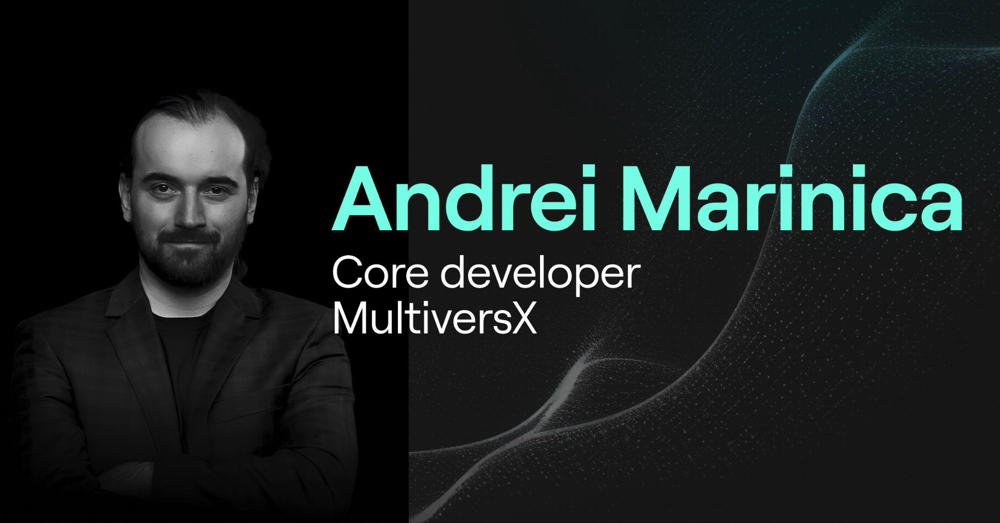

---

# The Course

- Lesson 1: Blockchain Overview
- Lesson 2: MultiversX Tooling
- Lesson 3: DeFi Basics
- Lesson 4: Your First dApp Tutorial (Part 1: Setup and Contract Deployment)
- Lesson 5: Your First dApp Tutorial (Part 2: Frontend Integration and Interaction)
- Lesson 6: Smart Contract Tutorial
- Lesson 7: Microservices and APIs
- Lesson 8: Project Help & Workshop 1
- Lesson 9: Project Help & Workshop 2
- Lesson 10: Project Help & Workshop 3

---

# Course Structure

- **Tuesday & Thursday, 19:00 – 20:30 UTC+01:00 (Spain time)**
- 40 min — first part
- 10 min — break
- 40 min — second part

---

# Say Hi!

- Let's know each other!
- How much experience have you had with blockchain?

---

# Preliminaries

- Blockchain can be dangerous, stay safe!
- Lost keys, scams, phishing, technical vulnerabilities.
- What you learn here might not work on other chains!
- We're here to build, not to get rich quickly!

---

# Lesson 1: Blockchain Basics

---

# What We Will Do Today

- Inspect live on-chain activity in the explorer
- Learn the key objects: account, transaction, block, token
- Create a wallet and get test EGLD from the faucet
- Track our own address in the explorer

---

# Before We Start

You only need to know five things:

1. A blockchain is a shared public record of changes.
2. A wallet manages keys.
3. An address is public.
4. A transaction is a signed instruction.
5. EGLD is the native token of MultiversX.

---

# Discovering the Explorer

- Blocks
- Transactions
- Accounts
- Tokens (fungible, non-fungible, semi-fungible)
- Validators

---

# Networks Matter

We must always know which network we are using.

- Mainnet: real value, production network
- Devnet: for testing and experimentation
- Testnet: testing network

If you look at the wrong network, the address and balance may appear different or empty.

---

# MultiversX Terms For Today

Only a few terms matter right now:

- account
- address
- transaction
- block
- token
- validator

We will not start with deep consensus or sharding theory.

---

# What To Notice In The Explorer

When we inspect an account page, look for:

- address
- balance
- nonce
- token holdings
- transaction history

The explorer is the public interface for reading blockchain activity.

---

# Reading A Transaction

When we open a transaction, focus on:

- sender
- receiver
- value
- fee
- status
- timestamp
- data field

This is enough to tell a first useful story about what happened.

---

# Reading A Block

A block is a batch of processed transactions.

When looking at a block page, the questions are simple:

- Which transactions were included?
- When was the block produced?
- How does a transaction connect back to a block?

For now, that is enough.

---

# What The Explorer Cannot Do

The explorer is for observation, not control.

It lets us:

- inspect
- verify
- trace

It does not let us sign on behalf of the account.

For that, we need a wallet.

---

# Decentralization

- No single owner or server — many independent participants
- Anyone can verify the state
- Trust is in the protocol, not an institution

---

# Sharding

- The network is split into shards that process transactions in parallel
- A Metachain coordinates across shards
- Your address belongs to a shard based on its last bytes
- Cross-shard transactions take slightly longer

---

# Break

---

# Live Demo: Wallet

---

# What To Notice In The Wallet

When you open a wallet, identify:

- your public address
- the selected network
- your balance
- receive action
- send action

The wallet is the control surface for your account.

---

# Safety Rules

- Never reveal your recovery phrase on screen.
- Never paste a real secret phrase into random websites.
- Use test funds for class exercises.
- Double-check addresses before sending.
- Make sure you know which network you are on.

---

# Wallet And Explorer Together

The wallet and explorer do different jobs:

- wallet: sign and initiate actions
- network: process actions
- explorer: show the result

This is the full loop we want to understand today.

---

# Live Demo: Wallet Address In Explorer

---

# Questions For Students

After opening your address in the explorer, answer:

- What is your address?
- What network are you on?
- What balance do you see?
- Do you have any transactions yet?
- If yes, what can you infer from one of them?

---

# What You Need To Remember

- The blockchain stores public state.
- The wallet manages keys.
- The address is public.
- The transaction is a signed instruction.
- The explorer shows what happened on-chain.

That is enough to begin working with blockchain systems in practice.

---

# Homework

Send devnet EGLD to this address: `erd10c03rvj9ptfsqjmek4vtdewhgd3wtvyghzu82qujkqd4x4rnhngssjkyj6`

- Go to [devnet-wallet.multiversx.com](https://devnet-wallet.multiversx.com)
- Request test EGLD from the faucet
- Send any amount to the address above
- Paste your transaction hash in the chat

Materials: [github.com/multiversx/blockchain-school/](github.com/multiversx/blockchain-school/)

---

# Next Time

- Sending transactions programmatically
- Basic tooling: Python, Rust, bash
- Deeper dive into the wallet
